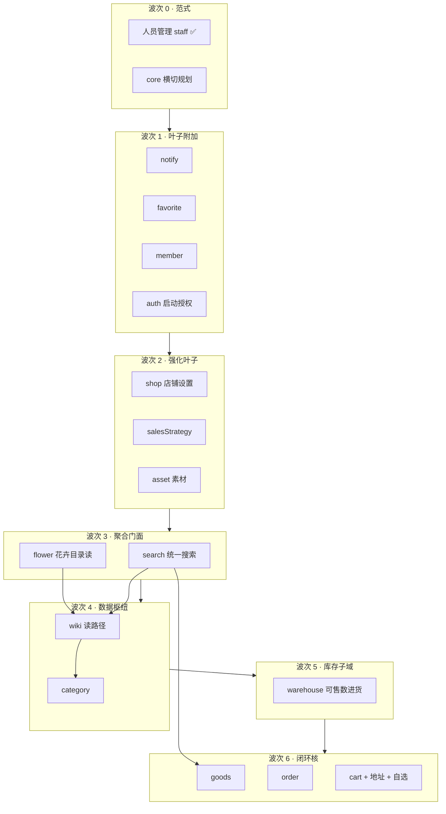

# 模块封装 · 升级优化策略

> **更新**：2026-07-06  
> **目的**：在改动巨大的前提下，**先做投入产出比最高的步骤**，减少返工与全链路回归。  
> **总规范**：[模块封装与API.md](./模块封装与API.md)

---

## 1. 效率原则（先读这个）

| 原则 | 为什么更高效 |
|------|----------------|
| **先叶子、后枢纽** | 调用方少、不被人依赖的模块，改完即可验收，几乎不触发连锁改 |
| **先文档摸底、再动代码** | 每模块先列「公开 API 清单 + 调用方表」，避免封完发现漏改或 API 设计返工 |
| **先横切、后业务** | `cloud` / 缓存失效 / 鉴权已部分收敛；业务模块只依赖 `@/modules/core`（规划）而非互引 `services` |
| **先拆「读/写」再封大类** | 智库、分类、花卉库共用 `flower_wiki`；**先定读路径 API**，再动维护写路径，否则分类要改两遍 |
| **同一云函数子域一次收拢** | `shop` 的主题配置、`goods` 的 media/inventory 分开成模块 API，但**一次读清 action**，避免多次拆 `shop`/`goods` |
| **闭环核最后收口** | 商品/订单/购物车 fan-in 最高；等外围模块 API 稳定后，闭环只「换 import 路径」，不改行为 |
| **每波可独立 merge** | 一波 = 1～2 个模块 + 文档 + build 通过；不攒大包 |

---

## 2. 模块分层（按改动风险）



---

## 3. 推荐执行顺序（效率优先）

> 下列序号 = **实际动手顺序**；与 [模块封装与API.md](./模块封装与API.md) 原「强化优先」表有调整，以**依赖与返工成本**为准。

### 波次 0 · 范式（已完成 / 进行中）

| 步骤 | 内容 | 产出 | 状态 |
|------|------|------|------|
| 0.1 | 检查点 push | `4eac500` | ✅ |
| 0.2 | 首模块范式 | `@/modules/staff` + API 文档 | ✅ |
| 0.3 | 横切 `core` 规划 | 文档定义：`cloud` 调用、错误解析仅经 `@/modules/core/cloud` | 待写一节 |

**不急着写 `core` 代码**：先把 2～3 个叶子模块跑通同一目录结构，再抽 `core`。

---

### 波次 1 · 叶子附加（改动小、建立节奏）

| 序 | 模块 | 调用方约 | 跨模块依赖 | 预估效率 |
|----|------|----------|------------|----------|
| 1 | **类 OA · notify** | 5～6 页 + 2 store | `auth`（hasToken） | ⭐⭐⭐ 高 — 云侧已分层 `bizNotifyEmit` |
| 2 | **收藏 · favorite** | 2～3 页 | `auth`、`cart`（加购） | ⭐⭐⭐ 高 — 独立 CF |
| 3 | **会员 · member** | 4 子页 | 几乎无 | ⭐⭐⭐ 高 — 当前多为本地 mock，先封 API 形状 |
| 4 | **启动授权 · auth** | login/mine/store 多处 | 被多模块依赖 | ⭐⭐ 中 — **宜在叶子封完后尽早做**，后续模块都引它 |

**本波不做**：智库、搜索、分类（fan-out 大）。

---

### 波次 2 · 强化叶子（与闭环弱耦合）

| 序 | 模块 | 说明 | 预估效率 |
|----|------|------|----------|
| 5 | **店铺设置 · shop** | `services/shop.ts` + `shopRepository`；首页/商城读店铺配置 | ⭐⭐ 中 — 先封 **读配置 API**，写配置随后 |
| 6 | **销售策略 · salesStrategy** | 实为 `shop` 主题子域；**依赖 shop 类型** | ⭐⭐ 中 — 在 shop 之后，避免主题类型重复定义 |
| 7 | **素材 · asset** | `goods` CF media handler；与 wiki 配图 Tab 有交叉 | ⭐⭐ 中 — API 文档先划清：素材 vs 智库配图 |

---

### 波次 3 · 聚合门面（减少 N×N 依赖）

| 序 | 模块 | 说明 | 为何在此做 |
|----|------|------|------------|
| 8 | **搜索 · search** | `customerUnifiedSearch` + 多页 `wikiRepository`/`goodsRepository` | 现在首页/商城/百科各引双 repo；**先统一 search API**，后面封 wiki/goods 时调用方更少 |
| 9 | **花卉目录 · flower（读）** | `flowerRepository` ← `wikiRepository` | 商品编辑 picker、分类导航都依赖；**读 API 独立成模块**后，智库维护可暂停而不动 picker |

---

### 波次 4 · 数据枢纽（一次拆对，避免返工）

| 序 | 模块 | 说明 | 注意 |
|----|------|------|------|
| 10 | **智库 · 读路径** | `wikiRepository` 公开：`ensurePublicList` / `ensureDetail` / `ensureMatch` / `search` | **不含**商家编辑、智能粘贴、笔记编辑器 |
| 11 | **智库 · 写路径（维护）** | `services/wiki.ts` 商户 CRUD、智能粘贴 | 产品暂停；只封 API + 文档，不扩功能 |
| 12 | **分类 · category** | `categoriesRepository` + `wiki:` 衍生 | **必须在 flower 读 + wiki 读之后** |

---

### 波次 5 · 仓储子域

| 序 | 模块 | 说明 |
|----|------|------|
| 13 | **可售数与进货 · warehouse** | `goods` CF `handlers/inventory.js` 已拆；前端 `services/warehouse.ts` 收拢 |

---

### 波次 6 · 基础闭环核（最后、换路径为主）

| 序 | 模块 | 说明 |
|----|------|------|
| 14 | **商品 · goods** | fan-in 最高；`goodsRepository` + `services/goods.ts` + 商家 composables |
| 15 | **订单 · order** | 与 notify 反应层已解耦，主要是 import 迁移 |
| 16 | **购物车 / 地址 / 自选** | 依赖 goods/order，顺序在 goods 之后 |

---

## 4. 每模块标准工序（控制单模块工时）

```text
① 摸底（0.5h）  — grep 调用方 + 列云 action → 草稿 API 表
② 文档（0.5h）  — docs/{模块}-API.md 定稿公开面
③ 封装（1～2h） — src/modules/{name}/api.ts + client.ts
④ 迁移（0.5h）  — 改 import；services 留 deprecated re-export
⑤ 验证          — npm run build:weapp
⑥ 提交          — 单模块单 commit，便于回滚
```

**禁止**：未写完 API 文档就大规模移动 `data/repository` 实现（Repository 应作为模块 **内部** 实现细节，从 `api` 后方逐步迁入）。

---

## 5. 明确延后 / 本阶段不做（避免低效）

| 项 | 原因 |
|----|------|
| 物理删除百科 Tab / `flower_wiki` | 商品花卉选择与分类衍生仍依赖 |
| 拆 `goods` 为多个独立云函数 | [架构耦合内聚优化](./架构耦合内聚优化.md) P2 可选；**handler 已拆**，前端封装优先 |
| 一次性迁完所有 `data/pages/*` | 体量大；随模块 API 稳定后，page setup 再改引 module |
| 智库维护 UI 新功能 | 产品已暂停 |
| 类 OA 体验版联测 | 产品已暂停；封装与联测分开 |
| ESLint 强制 import 边界 | 等 3～4 个模块完成后再加 CI，避免规则反复改 |

---

## 6. 近期三迭代建议（可直接排期）

| 迭代 | 目标 | 预计改动面 |
|------|------|------------|
| **迭代 1** | notify + favorite 封装 + API 文档 | ~10 文件，低风险 |
| **迭代 2** | auth 封装 + shop 读 API | ~15 文件，解除后续模块对 `services/auth` 散引 |
| **迭代 3** | search 门面 + flower 读 API | ~20 文件，显著减少首页/商城/分类的重复 repo 引 |

**销售策略**放在迭代 2 的 shop 之后（原「强化第 2」顺序调整原因）。

---

## 7. 与现有架构工作的关系

| 已完成 | 本策略如何利用 |
|--------|----------------|
| `merchantGate` | 各模块 API 文档「鉴权」一节统一指向它 |
| `cacheInvalidation` 矩阵 | 模块 API 文档注明 bump 事件，不重复造失效逻辑 |
| `goods/actionRegistry` | warehouse / asset 封装时按 handler 域划 API |
| `bizNotifyEmit` | notify 模块只暴露读收件箱 + 订阅；写通知不进 notify 模块公开 API |

---

## 8. 变更记录

| 日期 | 摘要 |
|------|------|
| 2026-07-06 | 初版：按改动效率重排波次；纠正「非仅 AI 插口」；staff 范式已完成 |
