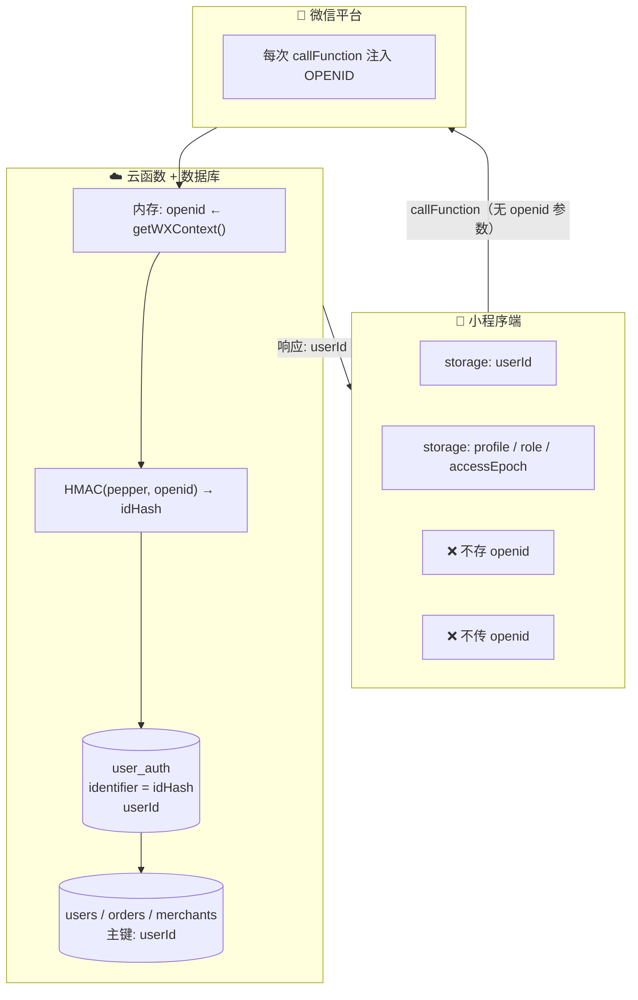
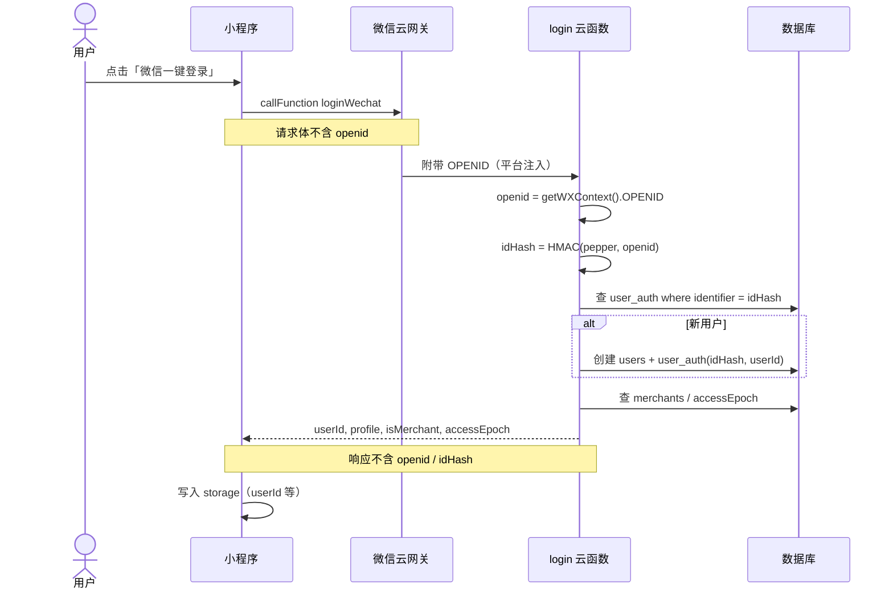
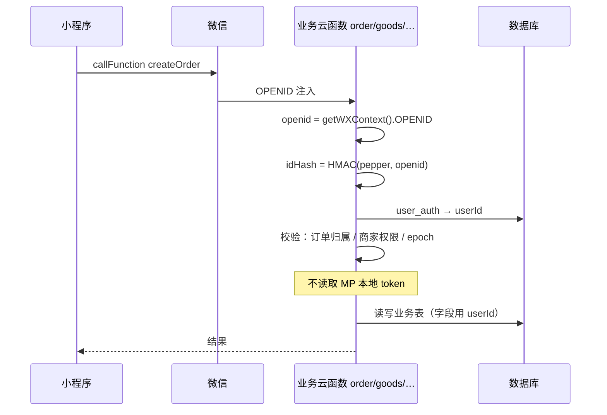
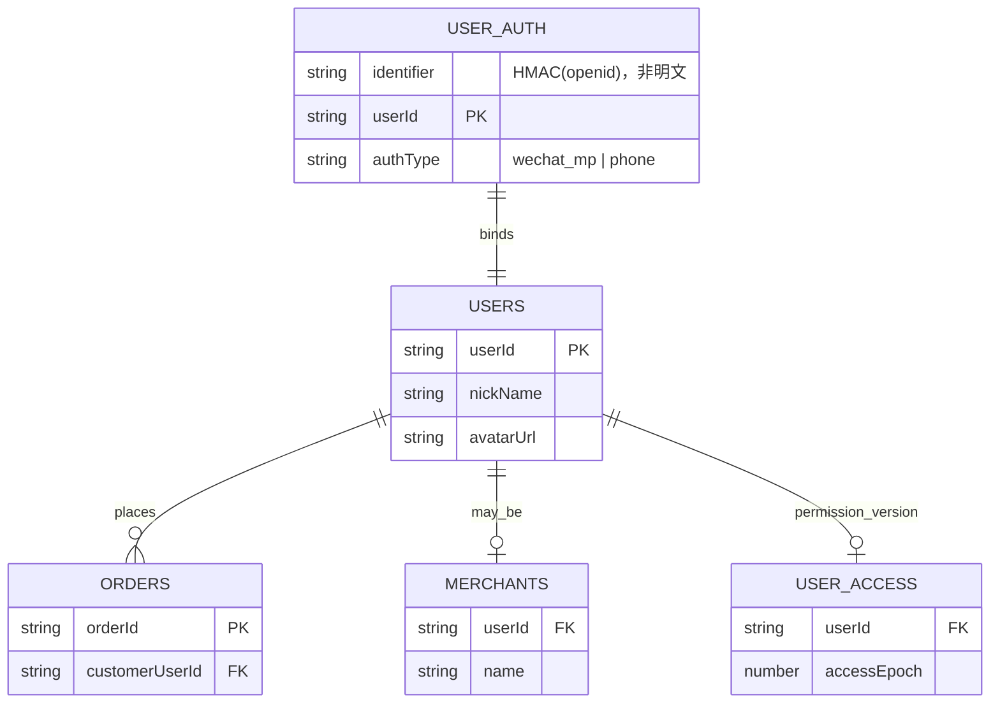
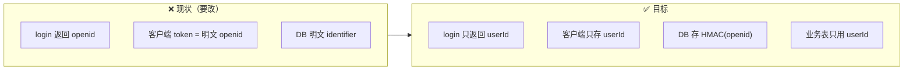
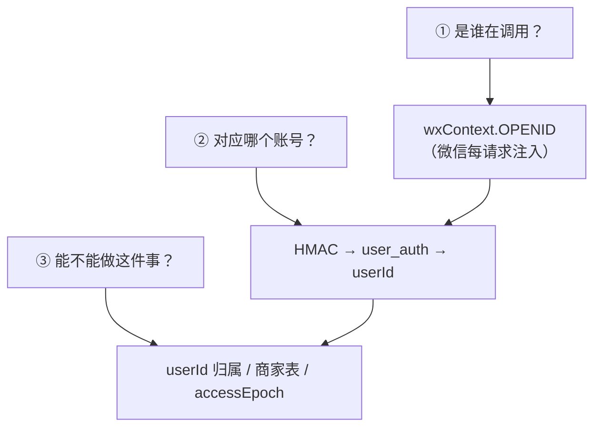

# 安全加固规划

> **所属**：[账号与安全模块](./账号与安全模块.md)  
> **状态**：规划（未开工）

---


**状态**：规划（未开工）  
**背景**：当前登录本质是「云函数读微信注入的 OpenID → 查/建用户 → 把 OpenID 当 token 存客户端」，存在暴露面与存储风险，需分阶段加固。

---

## 1. 先澄清：什么算「不安全」、什么其实是对的

### 1.1 已经做对的（应保留）

| 机制 | 说明 |
|------|------|
| **云端 OpenID 来源** | 各云函数通过 `cloud.getWXContext().OPENID` 识别调用者，**不由客户端上传**，小程序场景下无法伪造 |
| **订单等敏感写操作** | `order` 等用云端 OpenID 比对 `customerOpenid` / 商家校验，**不读本地 `token`** |
| **权限版本 `accessEpoch`** | staff 变更后 bump，客户端 `checkAccess` 对比 epoch，可收回 B 端入口（仍依赖再次调云函数） |

### 1.2 当前风险点（要改）

| 风险 | 现状 | 后果 |
|------|------|------|
| **客户端存 OpenID 当 token** | `STORAGE_KEYS.Token` = 明文 openid | 本地 storage 可读、抓包响应可见；被误当成「鉴权凭证」 |
| **登录响应回传 openid** | `login` → `buildSession` 返回 `openid` | 网络与日志暴露用户标识 |
| **库内明文 openid** | `user_auth.identifier`、`merchants.openid`、`user_access.openid`、legacy `users.openid` | 数据库导出/误配权限时直接泄露 |
| **硬编码店长 OpenID** | `login`、`order`、`initDb`、`flower` 等 `OWNER_OPENIDS` / `MERCHANT_OPENIDS` | 代码库泄露即白名单泄露；与 `merchants` 集合重复 |
| **客户端角色缓存** | `user_role` 本地存储 | 仅影响 UI；若某处误信本地 role 而不调云端 → 逻辑漏洞（需审计） |
| **身份码 QR** | `encodeIdentityQr(openid)` 明文嵌入 | 扫码即得 openid；B 端加人流程依赖明文 |
| **文档/测试 openid 进仓库** | `auth-account.md`、云函数常量 | 仓库可见 |

### 1.3 常见误解

- **OpenID 不是密码**，对它做 MD5/SHA256 **不能**代替登录态；哈希只降低「库泄露后直接可用」的风险，不能防冒充。
- **小程序 + 云开发**下，真正鉴权应始终是：**云函数内 wxContext OpenID（+ 业务 userId）**，而不是客户端带的字符串。

---

## 1.4 可视化理解（架构图）

> 以下图描述**目标态**；虚线框内为「仅服务端、仅内存」的明文 OpenID，不落库、不下发。

### 图 1 · 总览：三端各自持有什么



### 图 2 · 登录流程（时序）



### 图 3 · 任意业务请求：身份校验发生在哪里



### 图 4 · 数据存什么（对照表 + ER 简图）



| 数据 | 存明文 openid？ | 存 idHash？ | 存 userId？ |
|------|----------------|------------|------------|
| `user_auth` | ❌ | ✅ identifier | ✅ |
| `users` | ❌ | ❌ | ✅ 主键 |
| `orders` | ❌ 迁移淘汰 | ❌ | ✅ customerUserId |
| `merchants` / staff | ❌ 迁移淘汰 | ❌ | ✅ |
| 小程序 storage | ❌ | ❌ | ✅ + 资料缓存 |

### 图 5 · 现状 vs 目标（一眼对比）



### 图 6 · 身份校验三层（记住这三句）



**客户端本地「已登录」** 不参与 ①②③，只影响 UI（例如未登录跳转登录页）。

---

## 2. 目标态（0.2.x → 0.3.x 可分步）

### 2.1 原则

1. **客户端不持有、不传 OpenID**（顾客端）；只存 `userId` + 必要的展示资料缓存。
2. **所有写操作与权限判断在云端**完成，基于 `getWXContext().OPENID` 映射到 `userId`。
3. **持久化层**：OpenID 仅存服务端；`user_auth` 等用 **HMAC 标识符** 或 **仅云函数可写字段**。
4. **B 端人员/核销**：逐步从「明文 openid 交互」改为 **userId / 短期邀请码**；OpenID 仅服务端解析。
5. **硬编码白名单**迁入 `merchants` 集合或 **云开发环境变量**，代码库零明文。

### 2.2 目标数据流

```
用户点「微信登录」
  → 小程序 callFunction('login', { action: 'loginWechat' })
  → 云函数：openid = getWXContext().OPENID（仅此可信）
  → 查 user_auth（HMAC(identifier)）→ users.userId
  → 返回 { userId, profile, isMerchant, accessEpoch }  // 无 openid
  → 客户端存 userId + profile + role + accessEpoch

任意业务云函数
  → openid = getWXContext().OPENID
  → resolveUserId(openid)  // 内部 HMAC 查 auth
  → 执行业务 + 权限
```

可选（后期、跨端时再上）：

```
login 额外写入 user_sessions { sessionTokenHash, userId, expiresAt }
客户端存 sessionToken，非小程序通道携带；小程序仍优先 wxContext。
```

---

## 3. 分阶段实施

### 阶段 A · 客户端去 OpenID（P0，建议先做）

**目标**：暴露面立刻缩小，改动面可控。

| 项 | 动作 |
|----|------|
| A1 | `login` / `buildSession` **响应去掉 `openid`** |
| A2 | `auth.ts`：`persistSession` 不再写 `STORAGE_KEYS.Token`；`hasToken()` 改为 **`hasUserId()`**（看 `user_id`） |
| A3 | `userStore.openid` 改为可选/移除；「我的」身份码等 **改由云函数 `getIdentityCode` 返回脱敏或短期码**（见阶段 C） |
| A4 | 审计前端：无 `callFunction` 传 `openid` 作鉴权（当前基本无，确认即可） |
| A5 | 更新 `auth-account.md` 客户端 Session 描述 |

**验收**：抓包 login 无 openid；storage 无 `token` 明文 openid；下单/进 B 端仍正常。

---

### 阶段 B · 服务端标识符哈希（P1）

**目标**：库泄露不直接得到 OpenID 列表。

| 项 | 动作 |
|----|------|
| B1 | 云函数公共模块 `hashIdentifier(openid)`：`HMAC-SHA256(pepper, openid)`，pepper 放 **云开发环境变量** `AUTH_PEPPER` |
| B2 | `user_auth.identifier` 新写入用哈希；`findAuth` 查哈希 |
| B3 | **迁移脚本**（一次性云函数 `migrateAuthHash`）：读旧明文 → 写哈希字段 `identifierHash`，保留旧字段只读过渡 |
| B4 | `merchants` / `user_access`：优先改存 **`userId`**，openid 仅迁移期保留；查询商家：`openid → userId → merchants` |
| B5 | 去掉各云函数内 **`OWNER_OPENIDS` 硬编码**，仅查 `merchants` + 环境变量「bootstrap 店长 userId」 |

**验收**：新用户绑定走哈希；老用户迁移后登录正常；代码库无测试 openid 常量。

---

### 阶段 C · 身份码 / 人员管理脱敏（P1–P2）

**目标**：B 端不再在 UI/QR 里传播明文 OpenID。

| 项 | 动作 |
|----|------|
| C1 | 身份码 QR 改为 **`userId` 或 `invite:{shortToken}`**（短期有效，服务端 redeem） |
| C2 | `staff` 云函数：列表返回 **脱敏 id**；详情仅店长可见必要字段 |
| C3 | 加人流程：扫码 → 云函数解析 token → 服务端查 OpenID 绑定（**OpenID 不出现在 QR 字符串里**） |

**验收**：顾客身份码扫码后 B 端能加人；QR 内容非 openid 明文。

---

### 阶段 D · 会话与权限加固（P2，可选）

**目标**：支持登出吊销、多端扩展；强化 B 端门禁。

| 项 | 动作 |
|----|------|
| D1 | 集合 `user_sessions`：`sessionId`、`userId`、`createdAt`、`expiresAt`、`revoked` |
| D2 | `login` 签发随机 sessionId（仅当需要非 wx 通道时强制）；小程序仍以 wxContext 为主 |
| D3 | 公共中间件 `assertMerchant(openid)`：统一 epoch + merchants 校验，**禁止**仅信 event 参数 |
| D4 | `app.onShow` 的 `checkAccess` 失败 → 清 session + 提示重新登录 |
| D5 | 商家分包入口：**进入时必调** `checkAccess`，不仅看本地 `user_role` |

**验收**：移除 staff 后重新打开小程序，B 端入口关闭；本地改 role 无法调通写接口。

---

### 阶段 E · 手机号登录与短信（P2，启用 `ENABLE_PHONE_LOGIN` 时）

| 项 | 动作 |
|----|------|
| E1 | 短信验证码：频率限制、过期、错误次数锁定 |
| E2 | 生产环境去掉响应里的 `devCode` |
| E3 | 手机号与 wx OpenID 绑定冲突策略（合并账号 / 禁止重复） |

---

## 4. 不动或延后的

| 项 | 说明 |
|----|------|
| 完整 JWT / OAuth2 | 纯小程序 + 云开发暂不需要；AB 端拆包后再评估 |
| 客户端「加密存 openid」 | 无意义（密钥在客户端）；应 **不存** |
| 换 `code2Session` 自建后端 | 除非脱离云开发或要 unionId；当前非必须 |
| WMS / 出库与登录 | 无关，单列需求 |

---

## 5. 涉及文件（实施时对照）

| 层 | 路径 |
|----|------|
| 登录云函数 | `cloudfunctions/login/index.js`、`common/account.js` |
| 权限 epoch | `cloudfunctions/common/accessControl.js`（各函数 sync 副本） |
| 商家白名单 | `order`、`initDb`、`flower`、`login` 等 `OWNER_OPENIDS` |
| 前端 session | `src/services/auth.ts`、`src/stores/user.ts`、`src/utils/constants.ts` |
| 身份码 | `src/utils/identity.ts`、`IdentityQrModal.vue`、核销/人员页 |
| 文档 | `docs/auth-account.md`、本文 |

---

## 6. 待你拍板

1. **阶段 A 是否与 0.2.0 发版绑定** — 建议绑定（改动小、收益大）。
2. **`AUTH_PEPPER` 环境变量** — 是否已有云开发控制台配置习惯；无则阶段 B 用一次性生成的密钥文档化（不进 git）。
3. **身份码 QR 格式变更** — 是否接受旧 QR 失效（仅测试期可无兼容）。
4. **顾客端是否仍展示「身份码」全文** — 或改为仅 QR 图片、不可复制 openid。
5. **手机号登录** — 0.2.0 是否启用；不启用则阶段 E 后置。

---

## 7. 建议排期（与 Issue #2 并行）

```
现在          你：组件布局 / Head
↓
阶段 A（1–2 天）  去客户端 openid，改 hasToken
↓
0.2.0 回归       登录、下单、B 端、身份码冒烟
↓
阶段 B + C（3–5 天）  哈希 + 身份码/人员脱敏
↓
阶段 D（按需）    sessions + 商家入口硬校验
```

---

## 8. 回归清单（每阶段）

- [ ] 新用户微信一键登录 → 有 `userId`、无 storage openid
- [ ] 老用户升级后仍能登录
- [ ] 顾客下单、取消、地址同步
- [ ] 店长进 B 端、商品/订单写操作
- [ ] staff 添加/移除 → `accessEpoch` 生效
- [ ] 身份码扫码加人 / 核销（若已改 QR 格式则测新码）
- [ ] 登出后 `hasUserId()` 为 false，受保护页跳转登录
